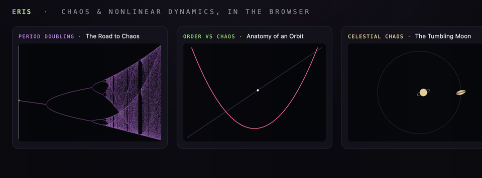

# Eris

**Chaos & nonlinear dynamics, in the browser.**

[](https://mikebertin.github.io/eris/)

Three interactive demos of *deterministic chaos* — systems with no randomness whatsoever
that are nonetheless impossible to predict — rebuilt from my undergraduate computational-physics
coursework (PH30055, ~2011, originally written in Maple). No build step, no dependencies,
no server: everything runs in the browser.

🔗 **[Live site](https://mikebertin.github.io/eris/)**

## The demos

| | | |
|---|---|---|
| **[The Road to Chaos](bifurcation/)** | Period doubling | The bifurcation diagram of the map xₙ₊₁ = xₙ² − r. A single value forks into 2, 4, 8… in a period-doubling cascade. Box-zoom into the fractal tree; Feigenbaum's constant δ ≈ 4.669 is computed live from the map's super-stable points. |
| **[Anatomy of an Orbit](cobweb/)** | Order vs chaos | A single trajectory drawn as a cobweb — spiralling to a fixed point, locking onto a cycle, or filling the interval — paired with the Lyapunov exponent λ(r). λ < 0 is order, λ > 0 is chaos; the periodic windows show up as downward spikes. |
| **[The Tumbling Moon](hyperion/)** | Celestial chaos | The chaotic rotation of Saturn's moon Hyperion, via the Wisdom–Peale–Mignard spin-orbit model. Watch the lumpy moon tumble as it orbits, and build the Poincaré section dot-by-dot to reveal the chaotic sea surrounding the regular resonance islands. |

## The physics

- **Bifurcation** iterates the quadratic map `x → x² − r` (the form used in the original
  coursework, conjugate to the textbook logistic map). For each value of `r` the transient is
  discarded and the attractor plotted, with density shaded logarithmically. The Feigenbaum ratio
  is found by solving `f_r^(2ⁿ)(0) = 0` for the super-stable parameters `Rₙ` with Newton's method.

- **Cobweb / Lyapunov** animates the same map as a cobweb diagram and computes
  `λ = ⟨ ln|f′(x)| ⟩ = ⟨ ln|2x| ⟩` along the orbit for every `r`, colouring the spectrum by sign.
  Periodicity is detected directly from the orbit's tail.

- **Hyperion** integrates the spin-orbit equation of motion with RK4,

  ```
  θ̈ = −(α²/2)(a/r)³ sin(2(θ − f)),   α² = 3(B−A)/C
  ```

  where `r(t)` and the true anomaly `f(t)` come from solving Kepler's equation along an
  eccentric orbit (precomputed into a lookup table). The Poincaré section samples `(θ mod π, θ̇)`
  at each perihelion passage; a renormalised shadow trajectory gives the Lyapunov exponent that
  classifies the motion as regular or chaotic. The drawn moon's elongation tracks the
  asphericity α.

Named for [Eris](https://en.wikipedia.org/wiki/Eris_(mythology)), the Greek goddess of strife
and discord — and the dwarf planet besides.

## Running locally

It's all static files — open `index.html`, or serve the folder:

```sh
python3 -m http.server 8731
```

Then visit <http://localhost:8731>.
